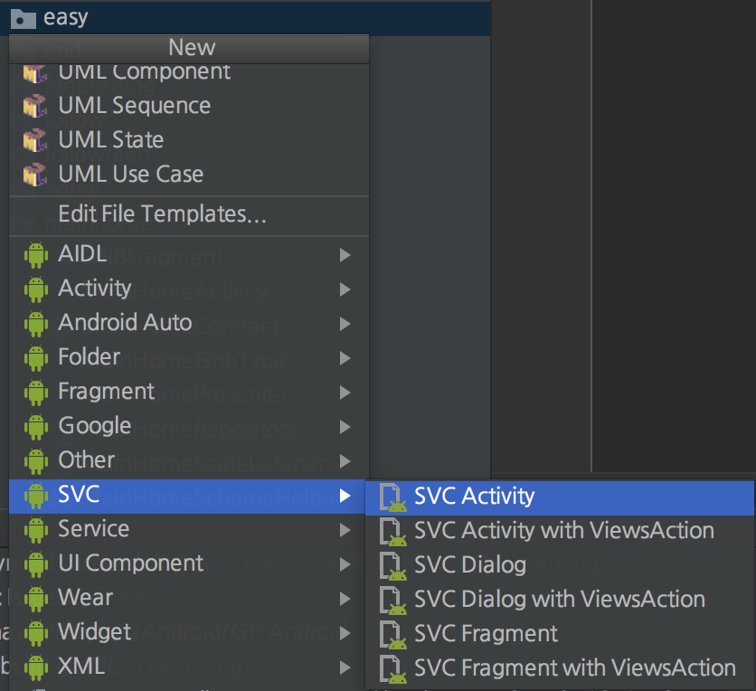
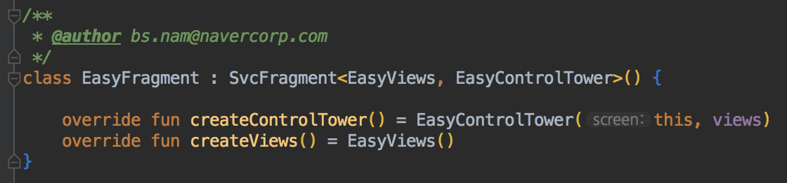

## What this project for?

If you want to start your project with SVC pattern this project can **save your time**.

It helps you to make several files which are necessary.


If you want to know about SVC and source code, click here link below.

https://github.com/naver/svc


## How to install

1. from root of project -> command -> ./install.sh (tested on mac)
2. restart AndroidStudio
3. done


## How to use

 1) clone `https://github.com/BansookNam/svcTemplate.git`

 2) run shell script through command line. (Terminal in mac)`./install.sh`

 3) restart Android Studio

 4) new -> SVC -> select SVC Activity /SVC Activity with ViewsAction /SVC Fragment /SVC Fragment with ViewsAction


 5) write screen name, author then click "Finish".

 

 

 You will see "Unresolved Reference" error.

 6) click "Build" - "Rebuild Project"
    This will create "SVC_{component}" based on annotations.

 

 7) **Done! Happy coding!**


## Dependency
1. the xml layout's root is constraintlayout so hope you use this layout.
Add below into your app build.gradle

```
implementation 'androidx.constraintlayout:constraintlayout:1.1.3' //or above
```


## Reference

```
https://github.com/riggaroo/android-studio-group-templates-mvp
```


## License
SVC Template is licensed under the Apache License, Version 2.0.
See [LICENSE](LICENSE) for full license text.

```
Copyright 2018 NAVER Corp.

Licensed under the Apache License, Version 2.0 (the "License");
you may not use this file except in compliance with the License.
You may obtain a copy of the License at

    http://www.apache.org/licenses/LICENSE-2.0

Unless required by applicable law or agreed to in writing, software
distributed under the License is distributed on an "AS IS" BASIS,
WITHOUT WARRANTIES OR CONDITIONS OF ANY KIND, either express or implied.
See the License for the specific language governing permissions and
limitations under the License.
```